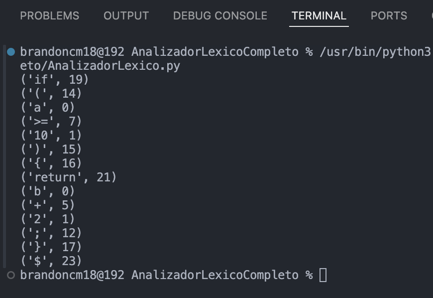

# Analizador Léxico

Este proyecto es un **analizador léxico en Python** que reconoce tokens de un lenguaje con las siguientes categorías:
- **Identificadores**
- **Números enteros y reales**
- **Operadores aritméticos, lógicos y de comparación**
- **Palabras reservadas (`if`, `while`, `return`, `else`, etc.)**
- **Símbolos especiales (`;`, `,`, `()`, `{}`)**

## Instalación y Uso

1. **Clonar el repositorio**
   ```sh
   git clone https://github.com/tu-usuario/analizador-lexico.git
   cd analizador-lexico
   ```
2. **Ejecutar el analizador léxico**
   ```sh
   python analizador_lexico.py
   ```

## Ejemplo de Entrada y Salida

### **Código de prueba:**
```c
if (a >= 10) { return b + 2; }
```

### **Salida esperada:**
```
('if', 19)
('(', 14)
('a', 0)
('>=', 7)
('10', 1)
(')', 15)
('{', 16)
('return', 21)
('b', 0)
('+', 5)
('2', 1)
(';', 12)
('}', 17)
('$', 23)
```

## Capturas de Ejecución



## Contribuciones
Si deseas contribuir, realiza un **fork** del repositorio y envía un **pull request**.

## Licencia
Este proyecto está bajo la licencia MIT.

